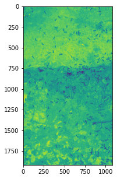
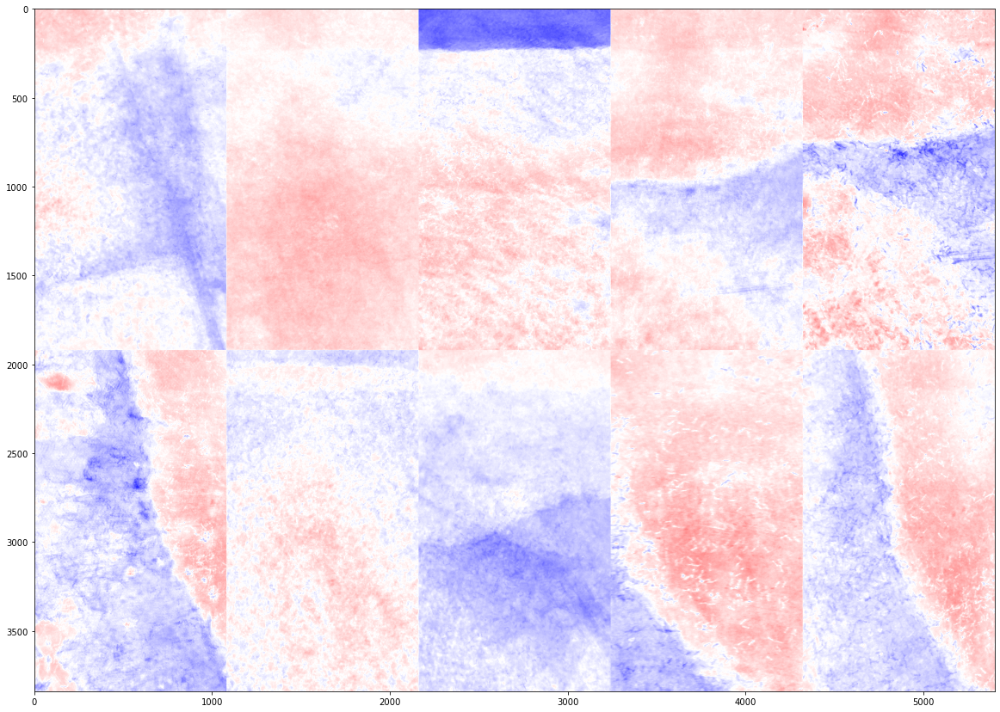
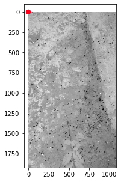
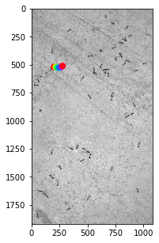
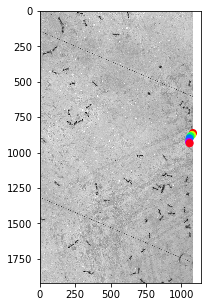

```python
import sys
!{sys.executable} -m pip install -U deepposekit
```

    Requirement already satisfied: deepposekit in ./opt/anaconda3/lib/python3.8/site-packages (0.3.9)
    Requirement already satisfied: pandas in ./opt/anaconda3/lib/python3.8/site-packages (from deepposekit) (1.2.4)
    Requirement already satisfied: numpy in ./opt/anaconda3/lib/python3.8/site-packages (from deepposekit) (1.19.5)
    Requirement already satisfied: imgaug>=0.2.9 in ./opt/anaconda3/lib/python3.8/site-packages (from deepposekit) (0.4.0)
    Requirement already satisfied: matplotlib in ./opt/anaconda3/lib/python3.8/site-packages (from deepposekit) (3.3.4)
    Requirement already satisfied: pyyaml in ./opt/anaconda3/lib/python3.8/site-packages (from deepposekit) (5.4.1)
    Requirement already satisfied: opencv-python in ./opt/anaconda3/lib/python3.8/site-packages (from deepposekit) (4.5.2.54)
    Requirement already satisfied: h5py in ./opt/anaconda3/lib/python3.8/site-packages (from deepposekit) (2.9.0)
    Requirement already satisfied: scikit-image>=0.14.2 in ./opt/anaconda3/lib/python3.8/site-packages (from imgaug>=0.2.9->deepposekit) (0.18.1)
    Requirement already satisfied: scipy in ./opt/anaconda3/lib/python3.8/site-packages (from imgaug>=0.2.9->deepposekit) (1.6.2)
    Requirement already satisfied: Pillow in ./opt/anaconda3/lib/python3.8/site-packages (from imgaug>=0.2.9->deepposekit) (8.2.0)
    Requirement already satisfied: six in ./opt/anaconda3/lib/python3.8/site-packages (from imgaug>=0.2.9->deepposekit) (1.15.0)
    Requirement already satisfied: imageio in ./opt/anaconda3/lib/python3.8/site-packages (from imgaug>=0.2.9->deepposekit) (2.9.0)
    Requirement already satisfied: Shapely in ./opt/anaconda3/lib/python3.8/site-packages (from imgaug>=0.2.9->deepposekit) (1.7.1)
    Requirement already satisfied: networkx>=2.0 in ./opt/anaconda3/lib/python3.8/site-packages (from scikit-image>=0.14.2->imgaug>=0.2.9->deepposekit) (2.5)
    Requirement already satisfied: tifffile>=2019.7.26 in ./opt/anaconda3/lib/python3.8/site-packages (from scikit-image>=0.14.2->imgaug>=0.2.9->deepposekit) (2020.10.1)
    Requirement already satisfied: PyWavelets>=1.1.1 in ./opt/anaconda3/lib/python3.8/site-packages (from scikit-image>=0.14.2->imgaug>=0.2.9->deepposekit) (1.1.1)
    Requirement already satisfied: pyparsing!=2.0.4,!=2.1.2,!=2.1.6,>=2.0.3 in ./opt/anaconda3/lib/python3.8/site-packages (from matplotlib->deepposekit) (2.4.7)
    Requirement already satisfied: kiwisolver>=1.0.1 in ./opt/anaconda3/lib/python3.8/site-packages (from matplotlib->deepposekit) (1.3.1)
    Requirement already satisfied: python-dateutil>=2.1 in ./opt/anaconda3/lib/python3.8/site-packages (from matplotlib->deepposekit) (2.8.1)
    Requirement already satisfied: cycler>=0.10 in ./opt/anaconda3/lib/python3.8/site-packages (from matplotlib->deepposekit) (0.10.0)
    Requirement already satisfied: decorator>=4.3.0 in ./opt/anaconda3/lib/python3.8/site-packages (from networkx>=2.0->scikit-image>=0.14.2->imgaug>=0.2.9->deepposekit) (5.0.6)
    Requirement already satisfied: pytz>=2017.3 in ./opt/anaconda3/lib/python3.8/site-packages (from pandas->deepposekit) (2021.1)


```python
import numpy as np
import cv2
import h5py
import matplotlib.pyplot as plt
from deepposekit.io import VideoReader, DataGenerator, initialize_dataset
from deepposekit.annotate import KMeansSampler
import tqdm
import glob
import pandas as pd

from os.path import expanduser

try:
    import google.colab
    IN_COLAB = True
except:
    IN_COLAB = False

HOME = expanduser("~") if not IN_COLAB else '.'
```

    /Users/chhavindergill/opt/anaconda3/lib/python3.8/site-packages/h5py/__init__.py:72: UserWarning: h5py is running against HDF5 1.10.4 when it was built against 1.8.4, this may cause problems
      _warn(("h5py is running against HDF5 {0} when it was built against {1}, "


```python
!git clone https://github.com/jgraving/deepposekit-data {HOME + '/deepposekit-data'}
```

    fatal: destination path '/Users/chhavindergill/deepposekit-data' already exists and is not an empty directory.


```python
videos = glob.glob(HOME + '/deepposekit-data/datasets/ants/*.mp4')
videos
```


    ['/Users/chhavindergill/deepposekit-data/datasets/ants/ants1.mp4']


```python
reader = VideoReader(HOME + '/deepposekit-data/datasets/ants/ants1.mp4', gray=True)
frame = reader[0] 
reader.close()
frame.shape
```


    (1, 1920, 1080, 1)


```python
plt.figure(figsize=(5,5))
plt.imshow(frame[0,...,0])
plt.show()
```


    

    


```python
reader = VideoReader(HOME + '/deepposekit-data/datasets/ants/ants1.mp4', batch_size=100, gray=True)

randomly_sampled_frames = []
for idx in tqdm.tqdm(range(len(reader)-1)):
    batch = reader[idx]
    random_sample = batch[np.random.choice(batch.shape[0], 10, replace=False)]
    randomly_sampled_frames.append(random_sample)
reader.close()

randomly_sampled_frames = np.concatenate(randomly_sampled_frames)
randomly_sampled_frames.shape
```

    100%|██████████| 11/11 [00:11<00:00,  1.04s/it]


    (110, 1920, 1080, 1)


```python
kmeans = KMeansSampler(n_clusters=10, max_iter=1000, n_init=10, batch_size=100, verbose=True)
kmeans.fit(randomly_sampled_frames)
```

    Init 1/10 with method: k-means++
    Inertia for init 1/10: 73267204088.355057
    Init 2/10 with method: k-means++
    Inertia for init 2/10: 76334029175.563019
    Init 3/10 with method: k-means++
    Inertia for init 3/10: 75224563007.126373
    Init 4/10 with method: k-means++
    Inertia for init 4/10: 77813260802.797562
    Init 5/10 with method: k-means++
    Inertia for init 5/10: 73082621827.763977
    Init 6/10 with method: k-means++
    Inertia for init 6/10: 69517288876.371902
    Init 7/10 with method: k-means++
    Inertia for init 7/10: 70937168367.126572
    Init 8/10 with method: k-means++
    Inertia for init 8/10: 75545768665.669785
    Init 9/10 with method: k-means++
    Inertia for init 9/10: 72262669563.842239
    Init 10/10 with method: k-means++
    Inertia for init 10/10: 72543159418.935699
    Minibatch iteration 1/2000: mean batch inertia: 829910228.975622, ewa inertia: 829910228.975622 
    Minibatch iteration 2/2000: mean batch inertia: 759184925.718623, ewa inertia: 759184925.718623 
    Minibatch iteration 3/2000: mean batch inertia: 761708964.445956, ewa inertia: 761708964.445956 
    Minibatch iteration 4/2000: mean batch inertia: 751075796.761054, ewa inertia: 751075796.761054 
    Minibatch iteration 5/2000: mean batch inertia: 749121011.919361, ewa inertia: 749121011.919361 
    Minibatch iteration 6/2000: mean batch inertia: 709503089.321061, ewa inertia: 709503089.321061 
    Minibatch iteration 7/2000: mean batch inertia: 739172737.816577, ewa inertia: 739172737.816577 
    Minibatch iteration 8/2000: mean batch inertia: 733744352.001493, ewa inertia: 733744352.001493 
    Minibatch iteration 9/2000: mean batch inertia: 742309420.028508, ewa inertia: 742309420.028508 
    Minibatch iteration 10/2000: mean batch inertia: 731344397.135689, ewa inertia: 731344397.135689 
    Minibatch iteration 11/2000: mean batch inertia: 779841581.415405, ewa inertia: 779841581.415405 
    Minibatch iteration 12/2000: mean batch inertia: 715138480.701096, ewa inertia: 715138480.701096 
    Minibatch iteration 13/2000: mean batch inertia: 747356894.619288, ewa inertia: 747356894.619288 
    Minibatch iteration 14/2000: mean batch inertia: 696467045.720408, ewa inertia: 696467045.720408 
    Minibatch iteration 15/2000: mean batch inertia: 721756943.004755, ewa inertia: 721756943.004755 
    Minibatch iteration 16/2000: mean batch inertia: 744038643.001237, ewa inertia: 744038643.001237 
    Minibatch iteration 17/2000: mean batch inertia: 735640047.525338, ewa inertia: 735640047.525338 
    Minibatch iteration 18/2000: mean batch inertia: 699598695.147131, ewa inertia: 699598695.147131 
    Minibatch iteration 19/2000: mean batch inertia: 745455057.607342, ewa inertia: 745455057.607342 
    Minibatch iteration 20/2000: mean batch inertia: 706261596.630815, ewa inertia: 706261596.630815 
    Minibatch iteration 21/2000: mean batch inertia: 751227686.143793, ewa inertia: 751227686.143793 
    Minibatch iteration 22/2000: mean batch inertia: 723721180.195759, ewa inertia: 723721180.195759 
    Minibatch iteration 23/2000: mean batch inertia: 729788081.123442, ewa inertia: 729788081.123442 
    Minibatch iteration 24/2000: mean batch inertia: 713678343.064543, ewa inertia: 713678343.064543 
    Converged (lack of improvement in inertia) at iteration 24/2000
    Computing label assignment and total inertia


    KMeansSampler(max_iter=1000, n_init=10, verbose=True)


```python
kmeans_sampled_frames, kmeans_cluster_labels = kmeans.sample_data(randomly_sampled_frames, n_samples_per_label=10)
kmeans_sampled_frames.shape
```

    Computing label assignment and total inertia
    Computing label assignment and total inertia


    (74, 1920, 1080, 1)


```python
kmeans.plot_centers(n_rows=2)
plt.show()
```


    

    


```python
skeleton = pd.read_csv(HOME + '/deepposekit-data/datasets/ants/ant_skeleton.csv')
skeleton
```


<div>
<style scoped>
    .dataframe tbody tr th:only-of-type {
        vertical-align: middle;
    }

    .dataframe tbody tr th {
        vertical-align: top;
    }

    .dataframe thead th {
        text-align: right;
    }
</style>
<table border="1" class="dataframe">
  <thead>
    <tr style="text-align: right;">
      <th></th>
      <th></th>
      <th>name</th>
      <th>parent</th>
      <th>swap</th>
    </tr>
  </thead>
  <tbody>
    <tr>
      <th>0</th>
      <td>0</td>
      <td>head</td>
      <td>NaN</td>
      <td>NaN</td>
    </tr>
    <tr>
      <th>1</th>
      <td>1</td>
      <td>eyeL</td>
      <td>head</td>
      <td>eyeR</td>
    </tr>
    <tr>
      <th>2</th>
      <td>2</td>
      <td>eyeR</td>
      <td>head</td>
      <td>eyeL</td>
    </tr>
    <tr>
      <th>3</th>
      <td>3</td>
      <td>neck</td>
      <td>head</td>
      <td>NaN</td>
    </tr>
    <tr>
      <th>4</th>
      <td>4</td>
      <td>thorax</td>
      <td>neck</td>
      <td>NaN</td>
    </tr>
    <tr>
      <th>5</th>
      <td>5</td>
      <td>abdomen</td>
      <td>thorax</td>
      <td>NaN</td>
    </tr>
  </tbody>
</table>
</div>


```python
initialize_dataset?
```


```python
initialize_dataset(
    images=kmeans_sampled_frames,
    datapath=HOME + '/deepposekit-data/datasets/ants/ants_annotation_set.h5',
    skeleton=HOME + '/deepposekit-data/datasets/ants/ant_skeleton.csv',
     overwrite=True # This overwrites the existing datapath
)
```


```python
DataGenerator?
```


```python
data_generator = DataGenerator(HOME + '/deepposekit-data/datasets/ants/ants_annotation_set.h5', mode="full")

image, keypoints = data_generator[0]

plt.figure(figsize=(5,5))
image = image[0] if image.shape[-1] is 3 else image[0, ..., 0]
cmap = None if image.shape[-1] is 3 else 'gray'
plt.imshow(image, cmap=cmap, interpolation='none')
for idx, jdx in enumerate(data_generator.graph):
    if jdx > -1:
        plt.plot(
            [keypoints[0, idx, 0], keypoints[0, jdx, 0]],
            [keypoints[0, idx, 1], keypoints[0, jdx, 1]],
            'r-'
        )
plt.scatter(keypoints[0, :, 0], keypoints[0, :, 1], c=np.arange(data_generator.keypoints_shape[0]), s=50, cmap=plt.cm.hsv, zorder=3)

plt.show()
```

    <>:6: SyntaxWarning: "is" with a literal. Did you mean "=="?
    <>:7: SyntaxWarning: "is" with a literal. Did you mean "=="?
    <>:6: SyntaxWarning: "is" with a literal. Did you mean "=="?
    <>:7: SyntaxWarning: "is" with a literal. Did you mean "=="?
    /Users/chhavindergill/opt/anaconda3/lib/python3.8/site-packages/h5py/_hl/dataset.py:312: H5pyDeprecationWarning: dataset.value has been deprecated. Use dataset[()] instead.
      warn("dataset.value has been deprecated. "
    <ipython-input-15-ee1b563f9a59>:6: SyntaxWarning: "is" with a literal. Did you mean "=="?
      image = image[0] if image.shape[-1] is 3 else image[0, ..., 0]
    <ipython-input-15-ee1b563f9a59>:7: SyntaxWarning: "is" with a literal. Did you mean "=="?
      cmap = None if image.shape[-1] is 3 else 'gray'


    

    


```python
pip install --upgrade pip && pip3 install h5py=='2.9.0'
```

    Requirement already satisfied: pip in ./opt/anaconda3/lib/python3.8/site-packages (21.1.3)
    Requirement already satisfied: h5py==2.9.0 in ./opt/anaconda3/lib/python3.8/site-packages (2.9.0)
    Requirement already satisfied: numpy>=1.7 in ./opt/anaconda3/lib/python3.8/site-packages (from h5py==2.9.0) (1.19.5)
    Requirement already satisfied: six in ./opt/anaconda3/lib/python3.8/site-packages (from h5py==2.9.0) (1.15.0)
    Note: you may need to restart the kernel to use updated packages.


```python
from deepposekit import Annotator
from os.path import expanduser
import glob
HOME = expanduser("~")
```


```python
app = Annotator(datapath=HOME + '/deepposekit-data/datasets/ants/ants_annotation_set.h5',
                dataset='images',
                skeleton=HOME + '/deepposekit-data/datasets/ants/ant_skeleton.csv',
                shuffle_colors=False,
                text_scale=0.2)
```


```python
app.run()
```

    Saved


```python
import tensorflow as tf

import numpy as np
import matplotlib.pyplot as plt
import glob

from deepposekit.io import TrainingGenerator, DataGenerator
from deepposekit.augment import FlipAxis
import imgaug.augmenters as iaa
import imgaug as ia

from deepposekit.models import (StackedDenseNet,
                                DeepLabCut,
                                StackedHourglass,
                                LEAP)
from deepposekit.models import load_model

from tensorflow.keras.callbacks import ReduceLROnPlateau, EarlyStopping

from deepposekit.callbacks import Logger, ModelCheckpoint


import time
from os.path import expanduser

try:
    import google.colab
    IN_COLAB = True
except:
    IN_COLAB = False

HOME = expanduser("~") if not IN_COLAB else '.'
```


```python
data_generator = DataGenerator(HOME + '/deepposekit-data/datasets/ants/ants_annotation_set.h5')
```


```python

image, keypoints = data_generator[0]

plt.figure(figsize=(5,5))
image = image[0] if image.shape[-1] is 3 else image[0, ..., 0]
cmap = None if image.shape[-1] is 3 else 'gray'
plt.imshow(image, cmap=cmap, interpolation='none')
for idx, jdx in enumerate(data_generator.graph):
    if jdx > -1:
        plt.plot(
            [keypoints[0, idx, 0], keypoints[0, jdx, 0]],
            [keypoints[0, idx, 1], keypoints[0, jdx, 1]],
            'r-'
        )
plt.scatter(keypoints[0, :, 0], keypoints[0, :, 1], c=np.arange(data_generator.keypoints_shape[0]), s=50, cmap=plt.cm.hsv, zorder=3)

plt.show()
```

    <>:4: SyntaxWarning: "is" with a literal. Did you mean "=="?
    <>:5: SyntaxWarning: "is" with a literal. Did you mean "=="?
    <>:4: SyntaxWarning: "is" with a literal. Did you mean "=="?
    <>:5: SyntaxWarning: "is" with a literal. Did you mean "=="?
    <ipython-input-22-bc693312fdbe>:4: SyntaxWarning: "is" with a literal. Did you mean "=="?
      image = image[0] if image.shape[-1] is 3 else image[0, ..., 0]
    <ipython-input-22-bc693312fdbe>:5: SyntaxWarning: "is" with a literal. Did you mean "=="?
      cmap = None if image.shape[-1] is 3 else 'gray'


    

    


```python
augmenter = []

augmenter.append(FlipAxis(data_generator, axis=0))  # flip image up-down
augmenter.append(FlipAxis(data_generator, axis=1))  # flip image left-right 

sometimes = []
sometimes.append(iaa.Affine(scale={"x": (0.95, 1.05), "y": (0.95, 1.05)},
                            translate_percent={'x': (-0.05, 0.05), 'y': (-0.05, 0.05)},
                            shear=(-8, 8),
                            order=ia.ALL,
                            cval=ia.ALL,
                            mode=ia.ALL)
                 )
sometimes.append(iaa.Affine(scale=(0.8, 1.2),
                            mode=ia.ALL,
                            order=ia.ALL,
                            cval=ia.ALL)
                 )
augmenter.append(iaa.Sometimes(0.75, sometimes))
augmenter.append(iaa.Affine(rotate=(-180, 180),
                            mode=ia.ALL,
                            order=ia.ALL,
                            cval=ia.ALL)
                 )
augmenter = iaa.Sequential(augmenter)
```

    /Users/chhavindergill/opt/anaconda3/lib/python3.8/site-packages/imgaug/augmenters/flip.py:984: DeprecationWarning: The parameter `deterministic` is deprecated in `imgaug.augmenters.meta.Augmenter`. Use `.to_deterministic()` to switch into deterministic mode.
      super(Flipud, self).__init__(


```python
image, keypoints = data_generator[0]
image, keypoints = augmenter(images=image, keypoints=keypoints)
plt.figure(figsize=(5,5))
image = image[0] if image.shape[-1] is 3 else image[0, ..., 0]
cmap = None if image.shape[-1] is 3 else 'gray'
plt.imshow(image, cmap=cmap, interpolation='none')
for idx, jdx in enumerate(data_generator.graph):
    if jdx > -1:
        plt.plot(
            [keypoints[0, idx, 0], keypoints[0, jdx, 0]],
            [keypoints[0, idx, 1], keypoints[0, jdx, 1]],
            'r-'
        )
plt.scatter(keypoints[0, :, 0], keypoints[0, :, 1], c=np.arange(data_generator.keypoints_shape[0]), s=50, cmap=plt.cm.hsv, zorder=3)

plt.show()
```

    <>:4: SyntaxWarning: "is" with a literal. Did you mean "=="?
    <>:5: SyntaxWarning: "is" with a literal. Did you mean "=="?
    <>:4: SyntaxWarning: "is" with a literal. Did you mean "=="?
    <>:5: SyntaxWarning: "is" with a literal. Did you mean "=="?
    <ipython-input-24-161febd67db6>:4: SyntaxWarning: "is" with a literal. Did you mean "=="?
      image = image[0] if image.shape[-1] is 3 else image[0, ..., 0]
    <ipython-input-24-161febd67db6>:5: SyntaxWarning: "is" with a literal. Did you mean "=="?
      cmap = None if image.shape[-1] is 3 else 'gray'


    

    


```python
train_generator = TrainingGenerator(generator=data_generator,
                                    downsample_factor=3,
                                    augmenter=augmenter,
                                    sigma=5,
                                    validation_split=0.1, 
                                    use_graph=True,
                                    random_seed=1,
                                    graph_scale=1)
train_generator.get_config()
```


    ---------------------------------------------------------------------------

    NameError                                 Traceback (most recent call last)

    <ipython-input-2-beb201d7396e> in <module>
    ----> 1 train_generator = TrainingGenerator(generator=data_generator,
          2                                     downsample_factor=3,
          3                                     augmenter=augmenter,
          4                                     sigma=5,
          5                                     validation_split=0.1,


    NameError: name 'TrainingGenerator' is not defined


```python
n_keypoints = data_generator.keypoints_shape[0]
batch = train_generator(batch_size=1, validation=False)[0]
inputs = batch[0]
outputs = batch[1]

fig, ((ax1, ax2), (ax3, ax4)) = plt.subplots(2, 2, figsize=(10,10))
ax1.set_title('image')
ax1.imshow(inputs[0,...,0], cmap='gray', vmin=0, vmax=255)

ax2.set_title('posture graph')
ax2.imshow(outputs[0,...,n_keypoints:-1].max(-1))

ax3.set_title('keypoints confidence')
ax3.imshow(outputs[0,...,:n_keypoints].max(-1))

ax4.set_title('posture graph and keypoints confidence')
ax4.imshow(outputs[0,...,-1], vmin=0)
plt.show()

train_generator.on_epoch_end()
```


```python
from deepposekit.models import DeepLabCut, StackedDenseNet, StackedHourglass, LEAP
```


```python
StackedDenseNet?
```


```python
DeepLabCut?
```


```python
#model = StackedDenseNet(train_generator, n_stacks=2, growth_rate=32, pretrained=True)

#model = DeepLabCut(train_generator, backbone="resnet50")
#model = DeepLabCut(train_generator, backbone="mobilenetv2", alpha=0.35) # Increase alpha to improve accuracy
model = DeepLabCut(train_generator, backbone="densenet121")

#model = LEAP(train_generator)
#model = StackedHourglass(train_generator)

model.get_config()
```


```python
logger = Logger(validation_batch_size=10,
    # filepath saves the logger data to a .h5 file
     filepath=HOME + "/deepposekit-data/datasets/ants/log_densenet.h5"
)
```


```python
reduce_lr = ReduceLROnPlateau(monitor="val_loss", factor=0.2, verbose=1, patience=20)
```


```python
model_checkpoint = ModelCheckpoint(
    HOME + "/deepposekit-data/datasets/fly/best_model_densenet.h5",
    monitor="val_loss",
    # monitor="loss" # use if validation_split=0
    verbose=1,
    save_best_only=True,
)
```


```python
early_stop = EarlyStopping(
    monitor="val_loss",
    # monitor="loss" # use if validation_split=0
    min_delta=0.001,
    patience=100,
    verbose=1
)
```


```python
callbacks = [early_stop, reduce_lr, model_checkpoint, logger]
```


```python
model.fit(
    batch_size=16,
    validation_batch_size=10,
    callbacks=callbacks,
    #epochs=1000, # Increase the number of epochs to train the model longer
    epochs=20,
    n_workers=8,
    steps_per_epoch=None,
)
```


```python

```
